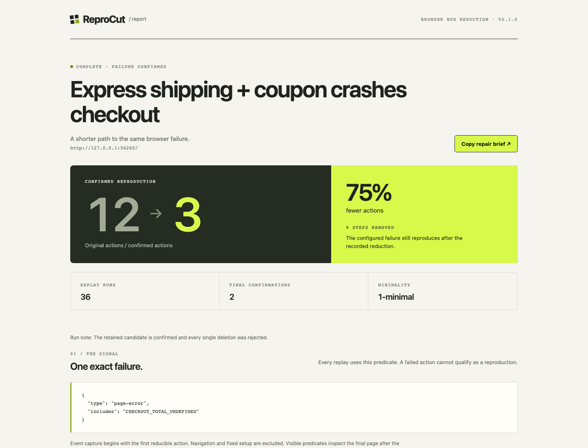

# ReproCut

### 更少步骤，同一个 Bug。

**自动缩减浏览器 Bug 的复现流程，导出可运行的回归测试和离线证据报告。**

[English](README.md) · [演示报告与版本下载](https://github.com/RealJasonHu/reprocut/releases/latest) · [流程格式](docs/journeys.md)

你知道怎样复现 Bug，但 12 个操作里，到底哪些是必要的？

ReproCut 会使用新的浏览器上下文反复重放流程，尝试删除操作。**只有剩余步骤仍然触发你指定的同一错误，才接受缩减。** 然后把更小的复现案例、截图、试验记录与回归测试交给开发者或 AI 编码助手。

## 运行真实演示

需要 Node.js 22+；首次使用需要下载 Chromium。不需要 API Key、模型或账户。

```bash
git clone https://github.com/RealJasonHu/reprocut.git
cd reprocut
npm install
npx playwright install chromium
npm run demo
```

打开 `reprocut-output/report.html`。演示会启动一个刻意包含 Bug 的本地商店，让真实 Chromium 执行流程，然后尝试把搜索、收藏、换主题等无关操作删除，保留“选择快递 → 输入优惠码 → 下单”的必要组合。报告中的次数、结果与截图均来自实际重放；这不是模型能力评测。

**已验证的内置案例：12 步 → 3 步，实际重放 36 次，步骤减少 75%。** 这是一个确定性的演示案例，不能代表所有应用。



也可以直接从 GitHub 安装版本：

```bash
npm install -g github:RealJasonHu/reprocut#v0.1.0
reprocut install
reprocut demo
```

项目提供 GitHub 源码与 Release 包，当前没有发布到 npm registry。

## 在你的项目中使用

```bash
node src/cli.js init --url http://localhost:3000 --out my-case
# 修改 my-case/journey.json，填写实际操作、选择器与错误特征
node src/cli.js shrink my-case/journey.json --out my-repro
```

- `setup`：固定的初始化步骤，不参与删除。
- `actions`：按照原顺序缩减的操作。
- `failure`：必须保留的明确症状，支持页面异常、控制台错误、HTTP 错误和可见错误文本。
- `options`：操作超时、观察窗口、视口大小。

输出包括 `report.html`、`report.json`、`repair.md`、原始和缩减后的 JSON 流程，以及 `regression.spec.js`。生成的回归测试会在目标 Bug 仍存在时失败，修复后通过；操作执行失败也会导致测试失败，避免把无效流程当作修复。

```bash
# 重新验证目标错误仍能复现
node src/cli.js replay my-repro/reduced.journey.json --out replay-check

# 在已安装 @playwright/test 的项目中执行回归测试
REPROCUT_URL=http://localhost:3000 npx playwright test my-repro/regression.spec.js
```

应用必须保持运行。演示结束后临时服务器会停止；可使用 `npm run demo:serve` 重启，再使用 `--url http://127.0.0.1:4173` 重放，或用 `REPROCUT_URL` 指定测试地址。

## 为什么值得使用

现有工具可以查看浏览器 Trace 或打包调试日志。ReproCut 的重点是**实际做删除试验，确认哪些步骤可以移除**。算法建立在已有的 [Delta Debugging](https://www.st.cs.uni-saarland.de/papers/tse2002/) 工作上，附加浏览器重放、重复确认、预算控制和可执行测试导出。

完整结果只承诺在本次试验下“不能再单独删除一个操作”，不保证全局最短，也不声称找到了根因。无效操作、不同异常和超时不会被当成目标错误复现。预算不足、原流程不能复现和观察到结果不稳定都会明确报告，并返回非零退出码。

## 当前边界

v0.1.0 支持 Chromium、单页面、JSON 声明流程、七种操作和四种失败条件。尚不支持自动录制、任意 Playwright 脚本/Trace 导入、iframe/popup 流程与自动重置服务端数据。

每次重放使用新的浏览器上下文，但数据库和外部服务不会随之重置。请在可重复初始化的测试环境使用，避免反复操作真实订单。异步初始化错误可能延迟进入观察窗口；重复复现不能排除所有偶发性问题。

报告包含输入值、URL、错误文本和截图，目前不自动脱敏。工具自身不上传报告、不调用模型，也没有遥测；被测网页仍可能访问自己的网络服务。

欢迎提交真实且已脱敏的案例、录制/导入功能、状态重置方案与新的失败条件。开发与贡献指南见 [CONTRIBUTING.md](CONTRIBUTING.md)。

MIT · [Zhexun Hu](https://github.com/RealJasonHu)
